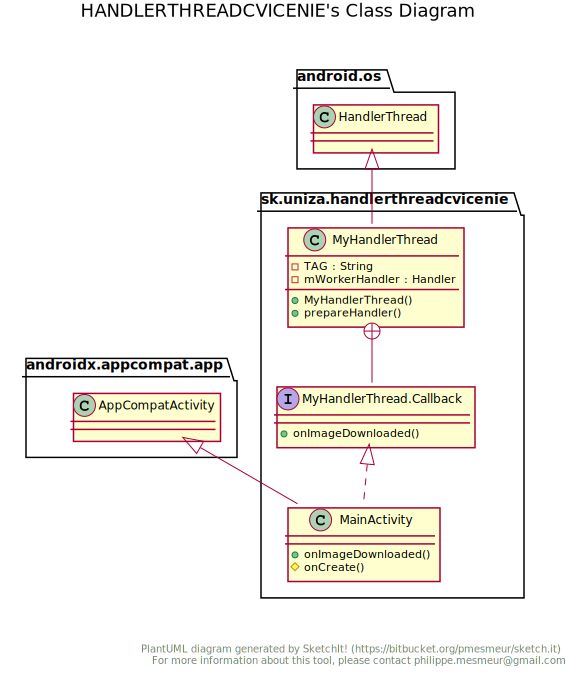

# Cvičenie - Multithreading

**Zadanie:**

<!--tgen file='/home/martin/AndroidStudioProjects/Docs/out.patch' lang=java tabs t_new="Nové" t_old="Pred úpravou" -->
Úlohou cvičenia je oboznámiť sa s použitím triedy `HandlerThread`. Táto trieda bude tvoriť pracovné vlákno, ktoré odbremení hlavné 'UI' vlákno od náročných úloh.   

Vytváraná aplikácia  má za úlohu stiahnuť obrázky z internetu  a po stiahnutí ich zobrazí v pripravenom Layoute. Požiadavky na aplikáciu:

- Obrázky sťahovať na pracovnom vlákne.

- Aplikácia sa musí prispôsobiť životnému cyklu aktivity:

    -  pri reštarte aplikácie sa pracovné vlákno musí ukončiť alebo sa opätovne využije pri reštarte aktivity.
    - Použiť singleton (jedináčik) návrhový vzor.
    - Využiť cache pamäť na uloženie stiahnutých obrázkov.

- Využiť `LifeCycle` na integrovanie životného cyklu hlavnej aktivity do pracovného vlákna

> Ukážka spolupráce hlavného a pracovného vlákna
  

> Ukážka výslednej aplikácie
>
> 

<!--tgen step=1.0 template="files_list.jinja" noupdate -->

### Postup práce

**Štartovací projekt naklonujte pomocou príkazu:**

`git clone https://github.com/hudikm/HandlerThreadCvicenie.git --branch Start_cvicenia --single-branch`

#### Adresárová štruktúra štartovacieho projektu [:link:](https://github.com/hudikm/HandlerThreadCvicenie/commit/af6bb53a561bb7a67eae5ed20c12c8eefad867f5/)

```
 .
 └─ app
    └─ src
       └─ main
          ├─ res
          │  └─ layout
          │     └─ activity_main.xml
          ├─ java
          │  └─ sk
          │     └─ uniza
          │        └─ handlerthreadcvicenie
          │           └─ MainActivity.java
          └─ AndroidManifest.xml
```

<!--end-->
<!--tgen lang=xml step=1.0 nohighlight tabs=false noupdate  -->
####1.0 Úprava layout-u aplikácie [:link:](https://github.com/hudikm/HandlerThreadCvicenie/commit/af6bb53a561bb7a67eae5ed20c12c8eefad867f5/)
Pre jednoduchosť použijeme `LinearLayout` , ktorý je vložený do `ScrollView` ako kontajner na zobrazenie stiahnutých obrázkov. 


>  **[🖹](https://github.com/hudikm/HandlerThreadCvicenie/blob/af6bb53a561bb7a67eae5ed20c12c8eefad867f5/app/src/main/res/layout/activity_main.xml) app/src/main/res/layout/activity_main.xml**


``` xml  
<?xml version="1.0" encoding="utf-8"?>
<LinearLayout xmlns:android="http://schemas.android.com/apk/res/android"
    xmlns:tools="http://schemas.android.com/tools"
    android:layout_width="match_parent"
    android:layout_height="match_parent"
    android:orientation="vertical"
    tools:context=".MainActivity">

    <ScrollView
        android:layout_width="wrap_content"
        android:layout_height="wrap_content"
        android:layout_gravity="center_horizontal">

        <LinearLayout
            android:id="@+id/imageContainer"
            android:layout_width="wrap_content"
            android:layout_height="wrap_content"
            android:orientation="vertical">

        </LinearLayout>
    </ScrollView>
</LinearLayout>

```

<!--end-->
####1.1 Vytvorenie MyHandlerThread triedy [:link:](https://github.com/hudikm/HandlerThreadCvicenie/commit/5b60840ed884ad84f626b5ee98352693cabac7e6/)


Vždy, keď je vytvorené nové vlákno je vhodné zavolať `setThreadPriority()` a nastaviť vláknu vhodnú prioritu tak aby plánovač  vybalancoval vytaženie CPU. Pre jednoduchšie zvolenie správnej priority existujú pomocné konštanty cez ktoré môžete zvoliť správnu prioritu viď. [Process](https://developer.android.com/reference/android/os/Process). Napríklad `THREAD_PRIORITY_DEFAULT` predstavuje predvolenú hodnotu pre vlákno. Aplikácia by mala nastaviť prioritu `THREAD_PRIORITY_BACKGROUND` pre vlákna, ktoré vykonávajú menej naliehavú prácu.


<!--tgen step=1.1 nohighlight -->

>  **[🖹](https://github.com/hudikm/HandlerThreadCvicenie/blob/5b60840ed884ad84f626b5ee98352693cabac7e6/app/src/main/java/sk/uniza/handlerthreadcvicenie/MyHandlerThread.java) app/src/main/java/sk/uniza/handlerthreadcvicenie/MyHandlerThread.java**


``` java tab="Nové" 
package sk.uniza.handlerthreadcvicenie;

import android.os.HandlerThread;
import android.os.Process;

public class MyHandlerThread extends HandlerThread {

    // Názov vlákna, ktorý je zobrazený pri debugovaní aplikácie
    private static final String TAG = MyHandlerThread.class.getSimpleName();

    public MyHandlerThread() {
        super(TAG);
        setPriority(Process.THREAD_PRIORITY_BACKGROUND); //Nastavenie
        // priority pracovnému vláknu

    }
}

```

<!--end-->

####1.2.a Vytvorenie rozhrania, ktoré sa použije na odovzdanie stiahnutého obrázku [:link:](https://github.com/hudikm/HandlerThreadCvicenie/commit/4b4a0f9a37a5ecbbc6197dbf6b74cbef1080fd07/)



<!--tgen step=1.2.a  noupdate -->

>  **[🖹](https://github.com/hudikm/HandlerThreadCvicenie/blob/4b4a0f9a37a5ecbbc6197dbf6b74cbef1080fd07/app/src/main/java/sk/uniza/handlerthreadcvicenie/MyHandlerThread.java) app/src/main/java/sk/uniza/handlerthreadcvicenie/MyHandlerThread.java**


``` java tab="Nové" hl_lines="3 6 13 14 15 16 17 24"
package sk.uniza.handlerthreadcvicenie;

import android.graphics.Bitmap;
import android.os.HandlerThread;
import android.os.Process;
import android.widget.ImageView;

public class MyHandlerThread extends HandlerThread {

    // Názov vlákna, ktorý je zobrazený pri debugovaní aplikácie
    private static final String TAG = MyHandlerThread.class.getSimpleName();

    // Rozhranie pomocou ktorého sa odovzdá stiahnutý obrázok
    public interface Callback {
        public void onImageDownloaded(ImageView imageView, Bitmap bitmap);
    }

    public MyHandlerThread() {
        super(TAG);
        setPriority(Process.THREAD_PRIORITY_BACKGROUND); //Nastavenie
        // priority pracovnému vláknu

    }
}

```

``` java tab="Pred úpravou" hl_lines="17"
package sk.uniza.handlerthreadcvicenie;

import android.os.HandlerThread;
import android.os.Process;

public class MyHandlerThread extends HandlerThread {

    // Názov vlákna, ktorý je zobrazený pri debugovaní aplikácie
    private static final String TAG = MyHandlerThread.class.getSimpleName();

    public MyHandlerThread() {
        super(TAG);
        setPriority(Process.THREAD_PRIORITY_BACKGROUND); //Nastavenie
        // priority pracovnému vláknu

    }
}

```

<!--end-->
<!--tgen step=1.2.b  -->
####1.2.b Použitie rozhrania MyHandlerThread.Callback [:link:](https://github.com/hudikm/HandlerThreadCvicenie/commit/f512c91c96472a26879f73d17e06ad4d1c0e8b94/)
>  **[🖹](https://github.com/hudikm/HandlerThreadCvicenie/blob/f512c91c96472a26879f73d17e06ad4d1c0e8b94/app/src/main/java/sk/uniza/handlerthreadcvicenie/MainActivity.java) app/src/main/java/sk/uniza/handlerthreadcvicenie/MainActivity.java**


``` java tab="Nové" hl_lines="3 5 9 10 17 18 19 20 21 22"
package sk.uniza.handlerthreadcvicenie;

import android.graphics.Bitmap;
import android.os.Bundle;
import android.widget.ImageView;

import androidx.appcompat.app.AppCompatActivity;

public class MainActivity extends AppCompatActivity
        implements MyHandlerThread.Callback {

    @Override
    protected void onCreate(Bundle savedInstanceState) {
        super.onCreate(savedInstanceState);
        setContentView(R.layout.activity_main);
    }

    @Override
    public void onImageDownloaded(ImageView imageView, Bitmap bitmap) {

    }
}

```

``` java tab="Pred úpravou" hl_lines="7 14"
package sk.uniza.handlerthreadcvicenie;

import android.os.Bundle;

import androidx.appcompat.app.AppCompatActivity;

public class MainActivity extends AppCompatActivity {

    @Override
    protected void onCreate(Bundle savedInstanceState) {
        super.onCreate(savedInstanceState);
        setContentView(R.layout.activity_main);
    }
}

```

<!--end-->

####1.3 Vytvorenie pomocnej metódy `prepareHandler` [:link:](https://github.com/hudikm/HandlerThreadCvicenie/commit/2607e74637e807bdd1111482f54696dc050a11fe/)

V tomto kroku najprv pripravíme  privátny atribút typu[`Handler`](https://developer.android.com/reference/android/os/Handler), ktorý predstavuje referenciu  na pracovný handler. Tento `Handler` bude prijímať a spracovávať pridelené pracovné úlohy z hlavného vlákna vo forme správ v callback metóde `handleMessage(@NonNull Message msg)` .  Objekt [`Message`](https://developer.android.com/reference/android/os/Message) definuje správu obsahujúcu popis a ľubovoľný dátový objekt, ktorý je možné poslať obsluhe `Handler`. Tento objekt obsahuje dve ďalšie int polia a jedno pole extra objektu.
Najlepším spôsobom, ako získať inštanciu objektu, je zavolať metódu `Message.obtain()` alebo jednu z metód `Handler.obtainMessage()`, ktorá ich vytiahne zo skupiny recyklovaných objektov.

!!! note "Prepojenie vytvorenej triedy `Handler` s triedou `HandlerThread`"
	Trieda `HandlerThread` obsahuje tzv. `Looper`, ktorý treba prepojiť s vytvorenou triedou `Handler`. Looper získame cez `getLooper()` a referenciu odovzdáme cez konštruktor triedy `Handler`.(`new Handler(getLooper())`). 
	
	!!! warning
		Ak by sme zavolali prázdny konštruktor, tak tento `Handler` by si vyžiadal `Looper` od vlákna na ktorom bol vytvorený objekt `Handler`. V našom prípade by to bolo hlavné vlákno a teda všetky úlohy by boli vykonané na hlavnom vlákne a nie na pracovnom `HandlerThread`vlákne.

<!--tgen step=1.3  -->

>  **[🖹](https://github.com/hudikm/HandlerThreadCvicenie/blob/2607e74637e807bdd1111482f54696dc050a11fe/app/src/main/java/sk/uniza/handlerthreadcvicenie/MyHandlerThread.java) app/src/main/java/sk/uniza/handlerthreadcvicenie/MyHandlerThread.java**


``` java tab="Nové" hl_lines="4 6 8 9 10 17 18 19 20"
package sk.uniza.handlerthreadcvicenie;

import android.graphics.Bitmap;
import android.os.Handler;
import android.os.HandlerThread;
import android.os.Message;
import android.widget.ImageView;
import android.os.Process;

import androidx.annotation.NonNull;

public class MyHandlerThread extends HandlerThread {

    // Názov vlákna, ktorý je zobrazený pri debugovaní aplikácie
    private static final String TAG = MyHandlerThread.class.getSimpleName();

    // Definovanie pracovného handlera, ktorý z prideleného loopera príjima
    // pridelenú prácu
    private Handler mWorkerHandler;

    // Rozhranie pomocou ktorého sa odovzdá stiahnutý obrázok
    public interface Callback {
        public void onImageDownloaded(ImageView imageView, Bitmap bitmap);

```

``` java tab="Pred úpravou" hl_lines="5"
package sk.uniza.handlerthreadcvicenie;

import android.graphics.Bitmap;
import android.os.HandlerThread;
import android.os.Process;
import android.widget.ImageView;

public class MyHandlerThread extends HandlerThread {

    // Názov vlákna, ktorý je zobrazený pri debugovaní aplikácie
    private static final String TAG = MyHandlerThread.class.getSimpleName();

    // Rozhranie pomocou ktorého sa odovzdá stiahnutý obrázok
    public interface Callback {
        public void onImageDownloaded(ImageView imageView, Bitmap bitmap);

```

 > public class MyHandlerThread extends HandlerThread {

``` java tab="Nové" hl_lines="4 5 6 7 8 9 10 11 12 13 14 15 16 17 18 19 20 21"
        // priority pracovnému vláknu

    }

    /**
     * Pomocná metóda na inicializáciu HandlerThread ako pracovného vlákna
     */
    public void prepareHandler() {
        mWorkerHandler = new Handler(getLooper()) {
            /*
            V handleMessage callback metóde sa spracovávajú prijaté spravy na
             pracovnom vlákne HandlerThread
             */
            @Override
            public void handleMessage(@NonNull Message msg) {
                // Spracovanie prijatej správy
            }
        };
    }

}

```

``` java tab="Pred úpravou" hl_lines="4"
        // priority pracovnému vláknu

    }
}

```

<!--end-->

####1.4 Vytvorenie pomocnej triedy ImageUrl [:link:](https://github.com/hudikm/HandlerThreadCvicenie/commit/4982e6a93cac3633248e615b11d54e87ae8fa4bd/)
Táto pomocná trieda má za úlohu definovať typ správy pomocou konštanty `WHAT` ďalej držať url adresu obrázku, ktorý sa má stiahnúť a držať referenciu na ImageView, v ktorom sa zobrazí sťiahnutý obrázok.

!!! note 
	Referencia na  ImageView v ktorom sa zobrazí stiahnutý obrázok je vo forme [`WeakReference`](https://developer.android.com/reference/java/lang/ref/WeakReference?hl=en), ktorá má zabezpečiť aby nedochádzalo k memory leaku v prípade re-štartovania aplikácie.
     
<!--tgen step=1.4  nohighlight-->

>  **[🖹](https://github.com/hudikm/HandlerThreadCvicenie/blob/4982e6a93cac3633248e615b11d54e87ae8fa4bd/app/src/main/java/sk/uniza/handlerthreadcvicenie/ImageUrl.java) app/src/main/java/sk/uniza/handlerthreadcvicenie/ImageUrl.java**


``` java tab="Nové" 
package sk.uniza.handlerthreadcvicenie;

import android.widget.ImageView;

import java.lang.ref.WeakReference;

/*
  Dátova trieda, ktorá reprezentuje jeden obrázok, ktorý sa bude sťahovať
 */
public class ImageUrl {
    public static final int WHAT = 101; // Identifikátor správy
    public final String urlOfImage; //url adresa obrázku
    /*
     Referancia na  ImageView v ktorom sa zobrazí stiahnutý obrázok. Táto
     referencia je vo forme WeakReference, ktorá má zabezpečiť aby
     nedochádzalo k memory leaku v prípade restartovania aplikácie
     */
    public final WeakReference<ImageView> uiToShowImage;

    public ImageUrl(String urlOfImage, ImageView uiToShowImage) {
        this.urlOfImage = urlOfImage;
        this.uiToShowImage = new WeakReference<>(uiToShowImage);
    }
}

```

<!--end-->

####1.5 Vytvorenie metódy handleRequest určenej na stiahnutie obrázku z internetu na pracovnom vlákne [:link:](https://github.com/hudikm/HandlerThreadCvicenie/commit/bbf884bc75f66ed597f98c2985c5f1fc5b7dc525/)

Táto pomocná metóda, ktorá je spustená na pomocnom vlákne ma za úlohu pomocou `HttpURLConnection` stiahnuť obrázok z internetu a následne ho odovzdať ďalej zavolaním callback metódy `mCallback.onImageDownloaded`, ktorá je vykonaná na UI vlákne.  

!!! note "Odovzdanie `Runnable` objektu na hlavné UI vlákno"
	Aby sa callback metóda vykonala na hlavnom UI vlákne, je potrebné ju odovzdať vo forme pracovného objektu `Runnable` cez objekt `Handler`, ktorý je pripojený k hlavnému vláknu (`mResponseHandler` inicializácia je znázornená v nasledujúcom kroku).
	``` Java
	   mResponseHandler.post(new Runnable() {
                    @Override
                    public void run() {
                        // Spustené na UI vlákne
                        mCallback.onImageDownloaded(
                                imageUrl.uiToShowImage.get(),
                                bitmap);
                    }
                });
            }
	``` 


!!! note 
	`this.sleep(500)` simuluje pomalé pripojenie na internet.

<!--tgen step=1.5  -->
**[🖹](https://github.com/hudikm/HandlerThreadCvicenie/blob/bbf884bc75f66ed597f98c2985c5f1fc5b7dc525/app/src/main/java/sk/uniza/handlerthreadcvicenie/MyHandlerThread.java) app/src/main/java/sk/uniza/handlerthreadcvicenie/MyHandlerThread.java**


``` java tab="Nové" hl_lines="4 8 14 15 16 17 18"
package sk.uniza.handlerthreadcvicenie;

import android.graphics.Bitmap;
import android.graphics.BitmapFactory;
import android.os.Handler;
import android.os.HandlerThread;
import android.os.Message;
import android.os.Trace;
import android.widget.ImageView;
import android.os.Process;

import androidx.annotation.NonNull;

import java.io.IOException;
import java.io.InputStream;
import java.net.HttpURLConnection;
import java.net.URL;

public class MyHandlerThread extends HandlerThread {

    // Názov vlákna, ktorý je zobrazený pri debugovaní aplikácie

```

``` java tab="Pred úpravou" 
package sk.uniza.handlerthreadcvicenie;

import android.graphics.Bitmap;
import android.os.Handler;
import android.os.HandlerThread;
import android.os.Message;
import android.widget.ImageView;
import android.os.Process;

import androidx.annotation.NonNull;

public class MyHandlerThread extends HandlerThread {

    // Názov vlákna, ktorý je zobrazený pri debugovaní aplikácie

```

 > public class MyHandlerThread extends HandlerThread {

``` java tab="Nové" hl_lines="4 9 10 11 12 13 14 15 16 17 18 19 20 21 22 23 24 25 26 27 28 29 30 31 32 33 34 35 36 37 38 39 40 41 42 43 44 45 46 47 48 49 50 51"
            @Override
            public void handleMessage(@NonNull Message msg) {
                // Spracovanie prijatej správy

            }
        };
    }

    /*
        Metóda na stiahnutie obrázku z internetu, Táto metóda je je spustená
        na pracovnom vlákne!
     */
    private void handleRequest(final ImageUrl imageUrl) {

        try {
            final Bitmap bitmap;

            Trace.beginSection("HTTP download");
            HttpURLConnection connection =
                    (HttpURLConnection) new URL(imageUrl.urlOfImage)
                            .openConnection();
            connection.setRequestMethod("GET");
            bitmap = BitmapFactory
                    .decodeStream((InputStream) connection.getContent());

            try {
                this.sleep(500);
            } catch (InterruptedException e) {
                e.printStackTrace();
            }

            /*
                Stiahnutý obrázok sa odovzdá s pomocu Handler triedy UI
                vláknu, ktoré zavolá callback metódu
             */
            if (bitmap != null) {
                mResponseHandler.post(new Runnable() {
                    @Override
                    public void run() {
                        // Spustené na UI vlákne
                        mCallback.onImageDownloaded(
                                imageUrl.uiToShowImage.get(),
                                bitmap);
                    }
                });
            }

        } catch (IOException e) {
            e.printStackTrace();
        }
    }

}

```

``` java tab="Pred úpravou" 
            @Override
            public void handleMessage(@NonNull Message msg) {
                // Spracovanie prijatej správy
            }
        };
    }


}

```

<!--end-->

####1.6 Úprava konštruktora MyHandlerThread [:link:](https://github.com/hudikm/HandlerThreadCvicenie/commit/5e4d1ca0b3101bd41f536fc4ffe8cfac3cf1d92c/)

V tomto kroku upravíme konštruktor tak aby sme získali referenciou na `Handler` objekt, ktorý je spätý s hlavným vláknom a referenciu na implementované rozhranie `Callback`

<!--tgen step=1.6  -->
**[🖹](https://github.com/hudikm/HandlerThreadCvicenie/blob/5e4d1ca0b3101bd41f536fc4ffe8cfac3cf1d92c/app/src/main/java/sk/uniza/handlerthreadcvicenie/MyHandlerThread.java) app/src/main/java/sk/uniza/handlerthreadcvicenie/MyHandlerThread.java**

 > import android.graphics.BitmapFactory;

``` java tab="Nové" hl_lines="4"
import android.os.Handler;
import android.os.HandlerThread;
import android.os.Message;
import android.os.Process;
import android.os.Trace;
import android.widget.ImageView;

import androidx.annotation.NonNull;


```

``` java tab="Pred úpravou" hl_lines="6"
import android.os.Handler;
import android.os.HandlerThread;
import android.os.Message;
import android.os.Trace;
import android.widget.ImageView;
import android.os.Process;

import androidx.annotation.NonNull;


```

 > public class MyHandlerThread extends HandlerThread {

``` java tab="Nové" hl_lines="4 5 6 7 8 14 15 19 20"
    // pridelenú prácu
    private Handler mWorkerHandler;

    // Referencia na Handler, ktorý je spätý s UI vláknom
    private Handler mResponseHandler;
    // Referencia na Callback rozhranie
    private Callback mCallback;

    // Rozhranie pomocou ktorého sa odovzdá stiahnutý obrázok
    public interface Callback {
        public void onImageDownloaded(ImageView imageView, Bitmap bitmap);
    }

    public MyHandlerThread(Handler responseHandler,
                           Callback callback) {
        super(TAG);
        setPriority(Process.THREAD_PRIORITY_BACKGROUND); //Nastavenie
        // priority pracovnému vláknu
        mResponseHandler = responseHandler;
        mCallback = callback;
    }

    /**

```

``` java tab="Pred úpravou" hl_lines="9 13"
    // pridelenú prácu
    private Handler mWorkerHandler;

    // Rozhranie pomocou ktorého sa odovzdá stiahnutý obrázok
    public interface Callback {
        public void onImageDownloaded(ImageView imageView, Bitmap bitmap);
    }

    public MyHandlerThread() {
        super(TAG);
        setPriority(Process.THREAD_PRIORITY_BACKGROUND); //Nastavenie
        // priority pracovnému vláknu

    }

    /**

```

<!--end-->

####1.7 Spracovanie prijatej správy v `handleMessage` metóde [:link:](https://github.com/hudikm/HandlerThreadCvicenie/commit/0f5f82e1cafb524c64576b7722c7aede10b0389f/)

Ak prijatá správa obsahuje objekt, ktorý je typu `ImageUrl` tak ho odošleme na spracovanie do metódy `handleRequest`, ktorá daný obrázok stiahne z internetu.

<!--tgen step=1.7  -->

>  **[🖹](https://github.com/hudikm/HandlerThreadCvicenie/blob/0f5f82e1cafb524c64576b7722c7aede10b0389f/app/src/main/java/sk/uniza/handlerthreadcvicenie/MyHandlerThread.java) app/src/main/java/sk/uniza/handlerthreadcvicenie/MyHandlerThread.java**

 > public class MyHandlerThread extends HandlerThread {

``` java tab="Nové" hl_lines="4 5 6 7"
            @Override
            public void handleMessage(@NonNull Message msg) {
                // Spracovanie prijatej správy
                // Stiahnutie obrázkov z internetu
                if (msg.obj != null && msg.obj instanceof ImageUrl) {
                    handleRequest((ImageUrl) msg.obj);
                }
            }
        };
    }

```

``` java tab="Pred úpravou" hl_lines="4"
            @Override
            public void handleMessage(@NonNull Message msg) {
                // Spracovanie prijatej správy

            }
        };
    }

```

<!--end-->

####1.8 Vytvorenie a inicializovanie novej inštancie MyHandlerThread [:link:](https://github.com/hudikm/HandlerThreadCvicenie/commit/a98f5e44094b567d9ee8996bb09f7157b0ffa5b5/)

V predchádzajúcom kroku sme si upravili konštruktor triedy `MyHandlerThread` a teraz si pomocou neho vytvoríme novú inštanciu tejto triedy. 

!!! note
	V kroku 1.4 sme triedu `Handler` museli prepojiť manuálne s Looperom pomocou metódy `getLooper`. V tomto prípade prázdny konštuktor automaticky pripojí `Looper` hlavného vlákna s triedou `Handler`. 

<!--tgen step=1.8  -->
**[🖹](https://github.com/hudikm/HandlerThreadCvicenie/blob/a98f5e44094b567d9ee8996bb09f7157b0ffa5b5/app/src/main/java/sk/uniza/handlerthreadcvicenie/MainActivity.java) app/src/main/java/sk/uniza/handlerthreadcvicenie/MainActivity.java**

 > package sk.uniza.handlerthreadcvicenie;

``` java tab="Nové" hl_lines="3 5 12 13 14 19 20 21 22"
import android.graphics.Bitmap;
import android.os.Bundle;
import android.os.Handler;
import android.widget.ImageView;
import android.widget.LinearLayout;

import androidx.appcompat.app.AppCompatActivity;

public class MainActivity extends AppCompatActivity
        implements MyHandlerThread.Callback {

    private LinearLayout imageContainer;
    private MyHandlerThread myHandlerThread;

    @Override
    protected void onCreate(Bundle savedInstanceState) {
        super.onCreate(savedInstanceState);
        setContentView(R.layout.activity_main);
        myHandlerThread = new MyHandlerThread(new Handler(), this);

        myHandlerThread.start();
        myHandlerThread.prepareHandler();
    }

    @Override

```

``` java tab="Pred úpravou" 
import android.graphics.Bitmap;
import android.os.Bundle;
import android.widget.ImageView;

import androidx.appcompat.app.AppCompatActivity;

public class MainActivity extends AppCompatActivity
        implements MyHandlerThread.Callback {

    @Override
    protected void onCreate(Bundle savedInstanceState) {
        super.onCreate(savedInstanceState);
        setContentView(R.layout.activity_main);
    }

    @Override

```

<!--end-->
<!--tgen step=1.9 noupdate -->
####1.9 Vytvorenie a odoslanie zoznamu obrázkov na stiahnutie [:link:](https://github.com/hudikm/HandlerThreadCvicenie/commit/412fc748b292794093459f67fd144249df372e37/)
>  **[🖹](https://github.com/hudikm/HandlerThreadCvicenie/blob/412fc748b292794093459f67fd144249df372e37/app/src/main/java/sk/uniza/handlerthreadcvicenie/MainActivity.java) app/src/main/java/sk/uniza/handlerthreadcvicenie/MainActivity.java**

 > import androidx.appcompat.app.AppCompatActivity;

``` java tab="Nové" hl_lines="4 5 6 7"
public class MainActivity extends AppCompatActivity
        implements MyHandlerThread.Callback {

    // Url online služby, ktorá generuje obrázky s textom
    private String imageUrlLink = "https://dummyimage.com/300/09f/fff" +
            ".png&text=";

    private LinearLayout imageContainer;
    private MyHandlerThread myHandlerThread;


```

``` java tab="Pred úpravou" 
public class MainActivity extends AppCompatActivity
        implements MyHandlerThread.Callback {

    private LinearLayout imageContainer;
    private MyHandlerThread myHandlerThread;


```

 > public class MainActivity extends AppCompatActivity

``` java tab="Nové" hl_lines="4 11 12 13 14 15 16 17 18 19 20 21 22 23 24 25 26 27"
    protected void onCreate(Bundle savedInstanceState) {
        super.onCreate(savedInstanceState);
        setContentView(R.layout.activity_main);
        imageContainer = findViewById(R.id.imageContainer);
        myHandlerThread = new MyHandlerThread(new Handler(), this);

        myHandlerThread.start();
        myHandlerThread.prepareHandler();
    }

    @Override
    protected void onStart() {
        super.onStart();
        for (Integer i = 0; i < 10; i++) {
            ImageView imageView = new ImageView(this);
            // Informačný obrázok, že prebieha štahovanie
            imageView.setImageResource(R.drawable.loading);
            imageContainer.addView(imageView);

            // Zavolanie pomocnej metódy na uloženie správy do zásobíka.
            // Správy zo zásobníka sú spracované na pracovnom vlákne
            myHandlerThread
                    .queueTask(new ImageUrl(imageUrlLink.concat("img+" + i),
                            imageView));
        }
    }

    @Override
    public void onImageDownloaded(ImageView imageView, Bitmap bitmap) {


```

``` java tab="Pred úpravou" 
    protected void onCreate(Bundle savedInstanceState) {
        super.onCreate(savedInstanceState);
        setContentView(R.layout.activity_main);
        myHandlerThread = new MyHandlerThread(new Handler(), this);

        myHandlerThread.start();
        myHandlerThread.prepareHandler();
    }

    @Override
    public void onImageDownloaded(ImageView imageView, Bitmap bitmap) {


```

-----
**Vytvorenie pomocnej metódy na posunutie správy pracovnému `HandlerThread` vláknu.**

>  **[🖹](https://github.com/hudikm/HandlerThreadCvicenie/blob/412fc748b292794093459f67fd144249df372e37/app/src/main/java/sk/uniza/handlerthreadcvicenie/MyHandlerThread.java) app/src/main/java/sk/uniza/handlerthreadcvicenie/MyHandlerThread.java**

 > public class MyHandlerThread extends HandlerThread {

``` java tab="Nové" hl_lines="4 5 6 7 8 9 10 11 12 13"
        };
    }

    /**
     * Pomocná metóda na posunutie správy pracovnému HandlerThread vláknu
     *
     * @param imageUrl - obrázok, ktorý sa má stiahnuť
     */
    public void queueTask(ImageUrl imageUrl) {
        mWorkerHandler.obtainMessage(imageUrl.WHAT, imageUrl)
                .sendToTarget();
    }

    /*
        Metóda na stiahnutie obrázku z internetu, Táto metóda je je spustená
        na pracovnom vlákne!

```

``` java tab="Pred úpravou" 
        };
    }

    /*
        Metóda na stiahnutie obrázku z internetu, Táto metóda je je spustená
        na pracovnom vlákne!

```

<!--end-->
<!--tgen step=1.10  -->
####1.10 Zobrazenie stiahnutého obrázku [:link:](https://github.com/hudikm/HandlerThreadCvicenie/commit/450569817c45620198677de4a805febb0ff35c6d/)
>  **[🖹](https://github.com/hudikm/HandlerThreadCvicenie/blob/450569817c45620198677de4a805febb0ff35c6d/app/src/main/java/sk/uniza/handlerthreadcvicenie/MainActivity.java) app/src/main/java/sk/uniza/handlerthreadcvicenie/MainActivity.java**

 > public class MainActivity extends AppCompatActivity

``` java tab="Nové" hl_lines="3 4 5 6 7"
    @Override
    public void onImageDownloaded(ImageView imageView, Bitmap bitmap) {
        // Otestovanie či ImageView bol vytvorený v rovnakom kontexte. V
        // prípade reštatovania aplikácie, može ImageView pochádzať z už
        // zaniknutej inštancie Aplikácie.
        if (imageView.getContext() == this)
            imageView.setImageBitmap(bitmap);
    }
}

```

``` java tab="Pred úpravou" hl_lines="3"
    @Override
    public void onImageDownloaded(ImageView imageView, Bitmap bitmap) {

    }
}

```

<!--end-->
<!--tgen step=1.11  -->
####1.11 Pridanie povolenia pre prístup na internet [:link:](https://github.com/hudikm/HandlerThreadCvicenie/commit/54ef73ef68705d93477a23159fa354c3fde99707/)

>  **[🖹](https://github.com/hudikm/HandlerThreadCvicenie/blob/54ef73ef68705d93477a23159fa354c3fde99707/app/src/main/AndroidManifest.xml) app/src/main/AndroidManifest.xml**


``` java tab="Nové" hl_lines="4"
<manifest xmlns:android="http://schemas.android.com/apk/res/android"
    package="sk.uniza.handlerthreadcvicenie">

    <uses-permission android:name="android.permission.INTERNET" />
    <application
        android:allowBackup="true"
        android:icon="@mipmap/ic_launcher"

```

``` java tab="Pred úpravou" 
<manifest xmlns:android="http://schemas.android.com/apk/res/android"
    package="sk.uniza.handlerthreadcvicenie">

    <application
        android:allowBackup="true"
        android:icon="@mipmap/ic_launcher"

```

<!--end-->

!!! note

	Po tomto kroku by mala byť aplikácia spustiteľná a funkčná. Ale pri reštarte v plyvom konfiguračnej zmeny(napr. rotacia obrazovky) dochádza pri opätovnom spustení k vytvoreniu novej inštancie `MyHandlerThreadu`. **Ľubovolné pracovné vlákno(`Thread`,`HandlerThread` alebo aj vlákno späté s `AsyncTask`) nie je ovplyvneném životným cyklom aktivity, čo znamená, že bude na pozadí bežať ďalej.**  Čím viacej budeme otáčať zariadenia tým viac inštancií nám bude vznikať. viď obrázok s CPU profilera:
	
	Okrem vzniku nových inštancií, každé pracovné vlákno malo frontu pridelených správ a teda všetky vlákna, ktoré ešte nevyprázdnili svoju frontu úloh ďalej sťahovali obrázky aj keď sa už nepoužijú. viď obrázok s CPU profilera:
	
	Jednoduché riešenie toho problému je ukázané v nasledujúcom kroku.

####1.12 Reštart aplikácie vplyvom konfiguračnej zmeny. Minimálne riešenie [:link:](https://github.com/hudikm/HandlerThreadCvicenie/commit/86fd759c56640a5864e2627749d51c258b763619/)

Zavolaním v metóde `onDestroy` metódu z triedy `HandlerThread` `.quit()` vymažeme zvyšné úlohy z fronty správ, ktoré ešte neboli spracované. Na aktuálne vykonávanú úlohu to nemá vplyv a teda obrázok sa stiahne.  `HandlerThread` vlákno prejde do 'idle' stavu a časom ho systém odstráni. 


<!--tgen step=1.12  -->
**[🖹](https://github.com/hudikm/HandlerThreadCvicenie/blob/86fd759c56640a5864e2627749d51c258b763619/app/src/main/java/sk/uniza/handlerthreadcvicenie/MainActivity.java) app/src/main/java/sk/uniza/handlerthreadcvicenie/MainActivity.java**


``` java tab="Nové" 
package sk.uniza.handlerthreadcvicenie;

import android.graphics.Bitmap;

```

``` java tab="Pred úpravou" 
package sk.uniza.handlerthreadcvicenie;

import android.graphics.Bitmap;

```

 > public class MainActivity extends AppCompatActivity

``` java tab="Nové" hl_lines="4 5 6 7 8 9 10"
        if (imageView.getContext() == this)
            imageView.setImageBitmap(bitmap);
    }

    @Override
    protected void onDestroy() {
        super.onDestroy();
        myHandlerThread.quit();
    }
}

```

``` java tab="Pred úpravou" hl_lines="4"
        if (imageView.getContext() == this)
            imageView.setImageBitmap(bitmap);
    }
}

```

<!--end-->

####2.0 Využitie Singleton (jedináčik) návrhového vzoru [:link:](https://github.com/hudikm/HandlerThreadCvicenie/commit/bc1afda979d5a98775fd6d3d8838f89ffcf871ed/)

V predchádzajúcom prípade pri každom reštarte aplikácie nám vzniká nová inštancia triedy `MyHandlerThread`, čo nieje optimálne riešenie.  V tomto kroku prerobíme pôvodné riešenie s využitím návrhového vzoru Singleton, tak aby existovala iba jedna jediná inštancia triedy `MyHandlerThread`. 

!!! note
	Singleton (jednináčik) znamená, že trieda, ktorá implementuje tento návrhový vzor, má iba jednu jedinú inštanciu v celom programe. Táto inštancie je zdieľaná medzi jednotlivými komponentami aplikácie.  


<!--tgen step=2.0  -->
**[🖹](https://github.com/hudikm/HandlerThreadCvicenie/blob/bc1afda979d5a98775fd6d3d8838f89ffcf871ed/app/src/main/java/sk/uniza/handlerthreadcvicenie/MainActivity.java) app/src/main/java/sk/uniza/handlerthreadcvicenie/MainActivity.java**

 > public class MainActivity extends AppCompatActivity

``` java tab="Nové" hl_lines="4 6 7 8 9 10 11"
        super.onCreate(savedInstanceState);
        setContentView(R.layout.activity_main);
        imageContainer = findViewById(R.id.imageContainer);
        myHandlerThread = MyHandlerThread.getInstance(new Handler(), this);

        if (!myHandlerThread.isAlive()) {
            // Iba pri prvom spustení musí prebehnúť inicializácia
            // HandlerThread triedy
            myHandlerThread.start();
            myHandlerThread.prepareHandler();
        }
    }

    @Override

```

``` java tab="Pred úpravou" hl_lines="4 6 7"
        super.onCreate(savedInstanceState);
        setContentView(R.layout.activity_main);
        imageContainer = findViewById(R.id.imageContainer);
        myHandlerThread = new MyHandlerThread(new Handler(), this);

        myHandlerThread.start();
        myHandlerThread.prepareHandler();
    }

    @Override

```

 > public class MainActivity extends AppCompatActivity

``` java tab="Nové" hl_lines="4 5"
    @Override
    protected void onDestroy() {
        super.onDestroy();


    }
}

```

``` java tab="Pred úpravou" hl_lines="4"
    @Override
    protected void onDestroy() {
        super.onDestroy();
        myHandlerThread.quit();
    }
}

```

>  **[🖹](https://github.com/hudikm/HandlerThreadCvicenie/blob/bc1afda979d5a98775fd6d3d8838f89ffcf871ed/app/src/main/java/sk/uniza/handlerthreadcvicenie/MyHandlerThread.java) app/src/main/java/sk/uniza/handlerthreadcvicenie/MyHandlerThread.java**

 > import java.net.URL;

``` java tab="Nové" hl_lines="3 4 5"
public class MyHandlerThread extends HandlerThread {

    // Referencia na vytvorenú štanciu MyHandlerThread
    private static MyHandlerThread instance = null;

    // Názov vlákna, ktorý je zobrazený pri debugovaní aplikácie
    private static final String TAG = MyHandlerThread.class.getSimpleName();


```

``` java tab="Pred úpravou" 
public class MyHandlerThread extends HandlerThread {

    // Názov vlákna, ktorý je zobrazený pri debugovaní aplikácie
    private static final String TAG = MyHandlerThread.class.getSimpleName();


```

 > public class MyHandlerThread extends HandlerThread {

``` java tab="Nové" hl_lines="4 8 9 10 11 12 13 14 15 16 17 18 19 20"
        public void onImageDownloaded(ImageView imageView, Bitmap bitmap);
    }

    public MyHandlerThread() {
        super(TAG);
        setPriority(Process.THREAD_PRIORITY_BACKGROUND); //Nastavenie
        // priority pracovnému vláknu
    }

    public static MyHandlerThread getInstance(@NonNull Handler responseHandler,
                                              @NonNull Callback callback) {

        if (instance == null || !instance.isAlive()) {
            instance = new MyHandlerThread();
        }

        instance.mResponseHandler = responseHandler;
        instance.mCallback = callback;

        return instance;
    }

    /**

```

``` java tab="Pred úpravou" hl_lines="4 5 9 10"
        public void onImageDownloaded(ImageView imageView, Bitmap bitmap);
    }

    public MyHandlerThread(Handler responseHandler,
                           Callback callback) {
        super(TAG);
        setPriority(Process.THREAD_PRIORITY_BACKGROUND); //Nastavenie
        // priority pracovnému vláknu
        mResponseHandler = responseHandler;
        mCallback = callback;
    }

    /**

```

<!--end-->
<!--tgen step=2.1  -->
####2.1 Optimalizácia s pohladu reštartovania aktivity [:link:](https://github.com/hudikm/HandlerThreadCvicenie/commit/50622b7e7ace7e8daa4fa48456de70fa20a19ca5/)

>  **[🖹](https://github.com/hudikm/HandlerThreadCvicenie/blob/50622b7e7ace7e8daa4fa48456de70fa20a19ca5/app/src/main/java/sk/uniza/handlerthreadcvicenie/MainActivity.java) app/src/main/java/sk/uniza/handlerthreadcvicenie/MainActivity.java**

 > public class MainActivity extends AppCompatActivity

``` java tab="Nové" hl_lines="4"
    @Override
    protected void onDestroy() {
        super.onDestroy();
        myHandlerThread.onDestroy();

    }
}

```

``` java tab="Pred úpravou" hl_lines="4"
    @Override
    protected void onDestroy() {
        super.onDestroy();


    }
}

```

>  **[🖹](https://github.com/hudikm/HandlerThreadCvicenie/blob/50622b7e7ace7e8daa4fa48456de70fa20a19ca5/app/src/main/java/sk/uniza/handlerthreadcvicenie/MyHandlerThread.java) app/src/main/java/sk/uniza/handlerthreadcvicenie/MyHandlerThread.java**

 > public class MyHandlerThread extends HandlerThread {

``` java tab="Nové" hl_lines="4 5 6 7 8 9 10 11"
                .sendToTarget();
    }

    /**
     * Pomocná metóda, ktorá má byť spustená keď dôjde k reštartu aktivity
     */
    public void onDestroy() {
        // Odstránenie všetkých ešte nestiahnutých url adries so zásobníka
        mWorkerHandler.removeMessages(ImageUrl.WHAT);
    }

    /*
        Metóda na stiahnutie obrázku z internetu, Táto metóda je je spustená
        na pracovnom vlákne!

```

``` java tab="Pred úpravou" 
                .sendToTarget();
    }

    /*
        Metóda na stiahnutie obrázku z internetu, Táto metóda je je spustená
        na pracovnom vlákne!

```

<!--end-->

####2.2 Bezpečný prístupu k zdieľaným premenným z viacerých vláken [:link:](https://github.com/hudikm/HandlerThreadCvicenie/commit/5640d902328f7dd0b5cd5f5f998ad11f8ea71744/)

V prípade, kedy k zdieľaným premenným pristupuje viacero vláken, je nutné zabezpečiť tento prístup `synchronization` blokom do ktoré ma prístup v čase iba jediné vlákno. Táto problematika  je rozsiahla, ale    je nutné jej porozumieť aby nám aplikácia fungovala za všetkých okolností. [:link:](https://proandroiddev.com/synchronization-and-thread-safety-techniques-in-java-and-kotlin-f63506370e6d)

<!--tgen step=2.2  -->
**[🖹](https://github.com/hudikm/HandlerThreadCvicenie/blob/5640d902328f7dd0b5cd5f5f998ad11f8ea71744/app/src/main/java/sk/uniza/handlerthreadcvicenie/MyHandlerThread.java) app/src/main/java/sk/uniza/handlerthreadcvicenie/MyHandlerThread.java**

 > public class MyHandlerThread extends HandlerThread {

``` java tab="Nové" hl_lines="4 5"
    private volatile Handler mResponseHandler;
    // Referencia na Callback rozhranie
    private Callback mCallback;
    // Objekt určený na zabezpečenie bezpečného prístupu pri využití vláken
    private volatile Object syncObj = new Object();

    // Rozhranie pomocou ktorého sa odovzdá stiahnutý obrázok
    public interface Callback {

```

``` java tab="Pred úpravou" 
    private Handler mResponseHandler;
    // Referencia na Callback rozhranie
    private Callback mCallback;

    // Rozhranie pomocou ktorého sa odovzdá stiahnutý obrázok
    public interface Callback {

```

 > public class MyHandlerThread extends HandlerThread {

``` java tab="Nové" hl_lines="4 5 6 7"
        if (instance == null || !instance.isAlive()) {
            instance = new MyHandlerThread();
        }
        synchronized (instance.syncObj) {
            instance.mResponseHandler = responseHandler;
            instance.mCallback = callback;
        }
        return instance;
    }


```

``` java tab="Pred úpravou" hl_lines="4 5 6 7"
        if (instance == null || !instance.isAlive()) {
            instance = new MyHandlerThread();
        }

        instance.mResponseHandler = responseHandler;
        instance.mCallback = callback;

        return instance;
    }


```

 > public class MyHandlerThread extends HandlerThread {

``` java tab="Nové" hl_lines="4 5 6 7 8"
    public void onDestroy() {
        // Odstránenie všetkých ešte nestiahnutých url adries so zásobníka
        mWorkerHandler.removeMessages(ImageUrl.WHAT);
        // Bezpečné vynulovanie referencie na Handler, ktorý pri reštarte
        // aktivity bude po dobu reštartu neplatná
        synchronized (syncObj) {
            mResponseHandler = null;
        }
    }

    /*

```

``` java tab="Pred úpravou" 
    public void onDestroy() {
        // Odstránenie všetkých ešte nestiahnutých url adries so zásobníka
        mWorkerHandler.removeMessages(ImageUrl.WHAT);
    }

    /*

```

 > public class MyHandlerThread extends HandlerThread {

``` java tab="Nové" hl_lines="4 5 6 7 8 9 10 11 12 13 14 15 16 17"
                Stiahnutý obrázok sa odovzdá s pomocu Handler triedy UI
                vláknu, ktoré zavolá callback metódu
             */
            // Bezpečný prístup z pracovného vlákna
            synchronized (syncObj) {
                // Overenie, že referencia na Handler je platná
                if (mResponseHandler != null && bitmap != null) {
                    mResponseHandler.post(new Runnable() {
                        @Override
                        public void run() {
                            // Spustené na UI vlákne
                            mCallback.onImageDownloaded(
                                    imageUrl.uiToShowImage.get(),
                                    bitmap);
                        }
                    });
                }
            }

        } catch (IOException e) {

```

``` java tab="Pred úpravou" hl_lines="4 5 6 7 8 9 10 11 12 13"
                Stiahnutý obrázok sa odovzdá s pomocu Handler triedy UI
                vláknu, ktoré zavolá callback metódu
             */
            if (bitmap != null) {
                mResponseHandler.post(new Runnable() {
                    @Override
                    public void run() {
                        // Spustené na UI vlákne
                        mCallback.onImageDownloaded(
                                imageUrl.uiToShowImage.get(),
                                bitmap);
                    }
                });
            }

        } catch (IOException e) {

```

<!--end-->

####2.3 Aplikovanie Cache na rýchle načítanie už stiahnutých obrázkov [:link:](https://github.com/hudikm/HandlerThreadCvicenie/commit/9e00659e63e8d9b85a3e694b561fb1764bfdf114/)

Pre zamedzenie opätovného sťahovania implementujeme LRU cache do ktorej budeme zapisovať stiahnuté obrázky a pri reštarte sa obrázky miesto internetu načítajú z tejto cache.   

<!--tgen step=2.3  -->

>  **[🖹](https://github.com/hudikm/HandlerThreadCvicenie/blob/9e00659e63e8d9b85a3e694b561fb1764bfdf114/app/src/main/java/sk/uniza/handlerthreadcvicenie/MyHandlerThread.java) app/src/main/java/sk/uniza/handlerthreadcvicenie/MyHandlerThread.java**

 > import android.os.Handler;

``` java tab="Nové" hl_lines="7"
import android.os.HandlerThread;
import android.os.Message;
import android.os.Process;
import android.widget.ImageView;

import androidx.annotation.NonNull;
import androidx.collection.LruCache;

import java.io.IOException;
import java.io.InputStream;

```

``` java tab="Pred úpravou" hl_lines="4"
import android.os.HandlerThread;
import android.os.Message;
import android.os.Process;
import android.os.Trace;
import android.widget.ImageView;

import androidx.annotation.NonNull;

import java.io.IOException;
import java.io.InputStream;

```

 > public class MyHandlerThread extends HandlerThread {

``` java tab="Nové" hl_lines="4 5 6 7 8 9 10 11 12"
        public void onImageDownloaded(ImageView imageView, Bitmap bitmap);
    }

    // Cache na uloženie sťahovaných obrázkov
    final int cacheSize = 4 * 1024 * 1024; // 4MiB
    LruCache<String, Bitmap> bitmapCache =
            new LruCache<String, Bitmap>(cacheSize) {
                protected int sizeOf(String key, Bitmap value) {
                    return value.getByteCount();
                }
            };

    public MyHandlerThread() {
        super(TAG);
        setPriority(Process.THREAD_PRIORITY_BACKGROUND); //Nastavenie

```

``` java tab="Pred úpravou" 
        public void onImageDownloaded(ImageView imageView, Bitmap bitmap);
    }

    public MyHandlerThread() {
        super(TAG);
        setPriority(Process.THREAD_PRIORITY_BACKGROUND); //Nastavenie

```

 > public class MyHandlerThread extends HandlerThread {

``` java tab="Nové" hl_lines="4 5 6 7 8 9 10 11 12 13 14 15 16 17 18 19 20 21"
        try {
            final Bitmap bitmap;

            // Načítanie obrázku z cache(klúč je url adresa obrázku), ak nebol
            // nájdený metóda vráti null hodnotu
            Bitmap bitmapTmp = bitmapCache.get(imageUrl.urlOfImage);
            if (bitmapTmp == null) {
                HttpURLConnection connection =
                        (HttpURLConnection) new URL(imageUrl.urlOfImage)
                                .openConnection();
                connection.setRequestMethod("GET");
                bitmap = BitmapFactory
                        .decodeStream((InputStream) connection.getContent());
                bitmapCache.put(imageUrl.urlOfImage, bitmap);
                try {
                    this.sleep(500);
                } catch (InterruptedException e) {
                    e.printStackTrace();
                }
            } else {
                bitmap = bitmapTmp;
            }
            /*
                Stiahnutý obrázok sa odovzdá s pomocu Handler triedy UI
                vláknu, ktoré zavolá callback metódu

```

``` java tab="Pred úpravou" hl_lines="4 5 6 7 8 9 10 11 12 13 14 15 17"
        try {
            final Bitmap bitmap;

            Trace.beginSection("HTTP download");
            HttpURLConnection connection =
                    (HttpURLConnection) new URL(imageUrl.urlOfImage)
                            .openConnection();
            connection.setRequestMethod("GET");
            bitmap = BitmapFactory
                    .decodeStream((InputStream) connection.getContent());

            try {
                this.sleep(500);
            } catch (InterruptedException e) {
                e.printStackTrace();
            }

            /*
                Stiahnutý obrázok sa odovzdá s pomocu Handler triedy UI
                vláknu, ktoré zavolá callback metódu

```

<!--end-->

####3.0 Implementovanie [LifeCycle AndroidX](https://developer.android.com/topic/libraries/architecture/lifecycle) komponentu [:link:](https://github.com/hudikm/HandlerThreadCvicenie/commit/194619708e3bd14f62d08a6436d4907e3f9b450b/)

Komponenty, ktoré vnímajú životný cyklus vykonávajú určité akcie pri zmene stavu životného cyklu iného komponentu, ako sú aktivity a fragmenty. Tieto komponenty vám pomôžu vytvoriť lepšie usporiadaný a často štíhlejší kód, ktorý sa ľahšie udržuje.

Bežným vzorcom je implementácia činností závislých komponentov do životného cyklu metód aktivít alebo fragmentov. Tento model však vedie k zlej organizácii kód ak množeniu chýb. Použitím komponentov s  využitím `LifeCycle`  životného cyklu môžete presunúť kód závislých komponentov z metód životného cyklu  aktivity/fragmentu do samotných komponentov.

[`androidx.lifecycle`](https://developer.android.com/reference/androidx/lifecycle/package-summary) Balíček obsahuje triedy a rozhrania, ktoré umožňujú vytvárať komponenty, ktoré sú súčasťou životného cyklu aktivity/fragmentu, ktoré môžu automaticky upraviť svoje správanie v závislosti na aktuálnom stave životného cyklu aktivity alebo fragmentu.

Väčšina komponentov aplikácie, ktoré sú definované v platforme Android Framework, je k nim pripojená so životným cyklom. Životné cykly sú spravované operačným systémom alebo Framework kódom bežiacim vo vašom procese. Sú základom fungovania systému Android a vaša aplikácia ich musí rešpektovať. Ak tak neurobíte, môže to spôsobiť memory leak alebo dokonca zlyhanie aplikácie.

<!--tgen step=3.0  -->

>  **[🖹](https://github.com/hudikm/HandlerThreadCvicenie/blob/194619708e3bd14f62d08a6436d4907e3f9b450b/app/src/main/java/sk/uniza/handlerthreadcvicenie/MainActivity.java) app/src/main/java/sk/uniza/handlerthreadcvicenie/MainActivity.java**

 > public class MainActivity extends AppCompatActivity

``` java tab="Nové" hl_lines="4 5"
        super.onCreate(savedInstanceState);
        setContentView(R.layout.activity_main);
        imageContainer = findViewById(R.id.imageContainer);
        myHandlerThread = MyHandlerThread
                .getInstance(new Handler(), this, getLifecycle());

        if (!myHandlerThread.isAlive()) {
            // Iba pri prvom spustení musí prebehnúť inicializácia

```

``` java tab="Pred úpravou" hl_lines="4"
        super.onCreate(savedInstanceState);
        setContentView(R.layout.activity_main);
        imageContainer = findViewById(R.id.imageContainer);
        myHandlerThread = MyHandlerThread.getInstance(new Handler(), this);

        if (!myHandlerThread.isAlive()) {
            // Iba pri prvom spustení musí prebehnúť inicializácia

```

 > public class MainActivity extends AppCompatActivity

``` java tab="Nové" hl_lines="7"
            imageView.setImageBitmap(bitmap);
    }
   
	@Override
    protected void onDestroy() {
        super.onDestroy();

    }
}

```

``` java tab="Pred úpravou" 
            imageView.setImageBitmap(bitmap);
    }

    @Override
    protected void onDestroy() {
        super.onDestroy();
        myHandlerThread.onDestroy();

    }
}

```

>  **[🖹](https://github.com/hudikm/HandlerThreadCvicenie/blob/194619708e3bd14f62d08a6436d4907e3f9b450b/app/src/main/java/sk/uniza/handlerthreadcvicenie/MyHandlerThread.java) app/src/main/java/sk/uniza/handlerthreadcvicenie/MyHandlerThread.java**

 > import android.widget.ImageView;

``` java tab="Nové" hl_lines="3 4 5 12 13"
import androidx.annotation.NonNull;
import androidx.collection.LruCache;
import androidx.lifecycle.Lifecycle;
import androidx.lifecycle.LifecycleObserver;
import androidx.lifecycle.OnLifecycleEvent;

import java.io.IOException;
import java.io.InputStream;
import java.net.HttpURLConnection;
import java.net.URL;

public class MyHandlerThread extends HandlerThread implements
        LifecycleObserver {

    // Referencia na vytvorenú štanciu MyHandlerThread
    private static MyHandlerThread instance = null;

```

``` java tab="Pred úpravou" hl_lines="9"
import androidx.annotation.NonNull;
import androidx.collection.LruCache;

import java.io.IOException;
import java.io.InputStream;
import java.net.HttpURLConnection;
import java.net.URL;

public class MyHandlerThread extends HandlerThread {

    // Referencia na vytvorenú štanciu MyHandlerThread
    private static MyHandlerThread instance = null;

```

 > public class MyHandlerThread extends HandlerThread {

``` java tab="Nové" hl_lines="4 5"
    }

    public static MyHandlerThread getInstance(@NonNull Handler responseHandler,
                                              @NonNull Callback callback,
                                              @NonNull Lifecycle lifecycle) {

        if (instance == null || !instance.isAlive()) {
            instance = new MyHandlerThread();

```

``` java tab="Pred úpravou" hl_lines="4"
    }

    public static MyHandlerThread getInstance(@NonNull Handler responseHandler,
                                              @NonNull Callback callback) {

        if (instance == null || !instance.isAlive()) {
            instance = new MyHandlerThread();

```

 > public class MyHandlerThread extends HandlerThread {

``` java tab="Nové" hl_lines="4 5 6"
        synchronized (instance.syncObj) {
            instance.mResponseHandler = responseHandler;
            instance.mCallback = callback;
            // Zaregistrovanie LifeCycleObserver, ktorým je táto trieda
            // pripojená na životný cyklus nadradenej aktivity
            lifecycle.addObserver(instance);
        }
        return instance;
    }

```

``` java tab="Pred úpravou" 
        synchronized (instance.syncObj) {
            instance.mResponseHandler = responseHandler;
            instance.mCallback = callback;
        }
        return instance;
    }

```

 > public class MyHandlerThread extends HandlerThread {

``` java tab="Nové" hl_lines="3 5"
    /**
     * Pomocná metóda, ktorá má byť spustená keď dôjde k reštartu aktivity
     * Táto metóda je teraz pripojená na životný cyklus nadradenej aktivity
     */
    @OnLifecycleEvent(Lifecycle.Event.ON_DESTROY)
    public void onDestroy() {
        // Odstránenie všetkých ešte nestiahnutých url adries so zásobníka
        mWorkerHandler.removeMessages(ImageUrl.WHAT);

```

``` java tab="Pred úpravou" 
    /**
     * Pomocná metóda, ktorá má byť spustená keď dôjde k reštartu aktivity
     */
    public void onDestroy() {
        // Odstránenie všetkých ešte nestiahnutých url adries so zásobníka
        mWorkerHandler.removeMessages(ImageUrl.WHAT);

```

<!--end-->


